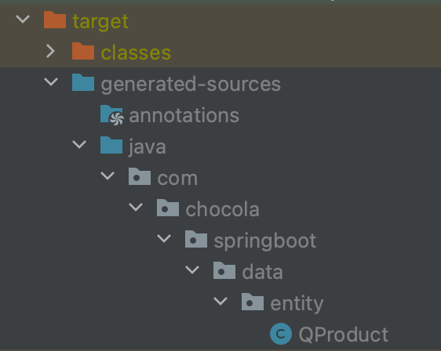

# Spring Boot

## Spring Data JPA

### @Query

&nbsp;&nbsp; Spring Data JPA에서 기본으로 제공해주는 메서드나 메서드 이름으로 만드는 쿼리로 모든 쿼리를 다 커버할 수는 없다.
복잡하고 정교한 쿼리를 짜기 위해서는 직접 쿼리를 작성할 필요가 있는데 그럴 때 사용하는 어노테이션이 `@Query` 어노테이션이다.

&nbsp;&nbsp; `@Query` 어노테이션의 값으로는 JPQL이라는 문법이 들어가는데, `@Query` 어노테이션의 속성들을 보니 Native Query로도 작성할 수 있는 것 같다.

#### JPQL

&nbsp;&nbsp; JPQL은 JPA에서 사용하는 쿼리 문법이다. JPQL은 엔티티를 기준으로 탐색한다.

- 파라미터 바인딩
- ?1, ?2, ... : 매개변수 위치를 기반으로 지정
- @Param : 매개변수 이름을 기반으로 지정

> **Example**
>
> ```java
> @Query("SELECT p FROM Product p Where p.name = ?1")
> List<Product> findByNameParameterBinding(String name);
> ```
> 
> ```java
> @Query("SELECT p FROM Product p Where p.name = :name")  
> List<Product> findByNameParameterBindingWithParam(@Param("name") String name);
> ```

<br>

## Querydsl

&nbsp;&nbsp; Querydsl은 문자열로 쿼리를 작성하는 대신 코드로 작성할 수 있게 도와주는 프레임워크이다.

### 장점

1. IDE가 제공하는 코드 자동 완성 기능을 사용할 수 있다.
2. 문법적으로 잘못된 쿼리를 허용하지 않는다. 즉, 정상적으로 활용된 Querydsl은 문법 오류를 발생시키지 않는다.
3. 동적인 쿼리를 쉽게 짤 수 있다.
4. 코드로 작성하므로 가독성 및 생산성이 향상된다.
5. 도메인 타입과 프로퍼티를 안전하게 참조할 수 있다.

&nbsp;&nbsp; Querydsl은 target 폴더에 도메인과 동일한 Q 타입의 클래스를 생성해서 사용한다.



### 사용 예시

```java
List<Product> productList = jpaQueryFactory
        .selectFrom(qProduct) // select() 메서드와 from() 메서드로 분리할 수 있다.
        .where(qProduct.name.eq("pen"))
        .orderBy(qProduct.price.desc())
        .fetch();
```

### 반환 메서드

1. `List<T> fetch()` : 조회 결과를 리스트로 반환
2. `T fetchOne()` : 단 건의 조회 결과를 반환, 조회 결과가 없으면 null을 반환하며 여러 개 조회될 경우 NonUniqueResultException 발생
3. `T fetchFirst()` : 첫번째 조회 결과를 반환, 조회 결과가 없으면 null을 반환
4. `Long fetchCount()` : 조회 결과의 개수를 반환
5. `QueryResults<T> fetchResults()` : 조회 결과 리스트와 개수를 포함한 QueryResults 객체를 반환

### Spring Data JPA

&nbsp;&nbsp; Spring Data JPA에서는 Querydsl을 편리하게 사용할 수 있도록 지원한다.

1. QuerydslPredicateExecutor

   ```java
   public interface QProductRepository extends JpaRepository<Product, Long>, QuerydslPredicateExecutor<Product> {
   }
   ```

   &nbsp;&nbsp; repository 인터페이스가 QuerydslPredicateExecutor 인터페이스를 상속 받아 사용 가능 : Predicate 표현식을 매개변수로 사용할 수 있다.

2. QuerydslRepositorySupport
   1. QuerydslRepositorySupport 클래스를 상속 받음
   2. 생성자에 있는 매개변수를 지우고 super()에 엔티티 클래스를 넘겨야함
   3. 스프링 빈으로 등록해서 사용

   ```java
   @Component
   public class ProductRepositoryCustomImpl extends QuerydslRepositorySupport implements ProductRepositoryCustom {

       public ProductRepositoryCustomImpl() {
           super(Product.class);
       }
   
       @Override
       public List<Product> findByName(String name) {
           QProduct qProduct = QProduct.product;
   
           return from(qProduct)
                   .where(qProduct.name.eq(name))
                   .fetch();
       }
   }
   ```

> **JPA에서 제공하는 쿼리 대신 내가 직접 구현해서 사용하고 싶다면?!**
> 
> 1. 내가 구현하고 싶은 메서드가 정의된 인터페이스 생성
> 2. 해당 인터페이스를 구현하는 클래스 생성 (이름은 인터페이스명 + Impl)
> 3. 사용 중인 Repository가 내가 정의한 인터페이스를 상속 받도록 하면 끝!

<br>

## JPA Auditing

&nbsp;&nbsp; 엔티티 클래스에 공통적으로 들어가는 필드가 있는 경우가 있다.
가령, '생성 일자', '생성한 사람', '변경 일자', '변경한 사람' 등이 있을 수 있는데,
이런 필드들은 엔티티가 여러 개일 경우 중복될 뿐 아니라 객체를 생성하거나 변경할 때마다 계속 값을 입력해야 하는 번거로움이 있다.

&nbsp;&nbsp; 이 문제를 해결하기 위해 Spring Data JPA는 JPA Auditing이라는 기능을 제공한다.

### 기능 활성화

1. Application 클래스에 `@EnableJpaAuditing` 어노테이션을 추가
2. Configuration 클래스를 별도로 분리해서 `@EnableJpaAuditing` 어노테이션을 추가

### 부모 클래스 만들기

&nbsp;&nbsp; 필드의 중복을 제거하기 위해서 자바에서는 보통 상속의 개념을 사용한다. JPA Auditing 기능에서도 똑같이 상속을 사용해서 중복을 제거할 수 있다.

- 부모 클래스에는 `@MappedSuperclass` 어노테이션을 붙여줘야함
- @EntityListeners 어노테이션을 이용해서 AuditingEntityListener 클래스가 제공하는 시간 세팅 로직을 적용
- @CreatedDate, @LastModifiedDate 어노테이션으로 생성, 수정 시간 필드로 설정

> BaseEntity

```java
@Getter
@Setter
@ToString
@MappedSuperclass
@EntityListeners(AuditingEntityListener.class)
public class BaseEntity {

    @CreatedDate
    @Column(updatable = false)
    private LocalDateTime createdAt;

    @LastModifiedDate
    private LocalDateTime updatedAt;
}
```

<br>

> Product

```java
@Getter
@Setter
@NoArgsConstructor
@ToString(callSuper = true)
@Entity
public class Product extends BaseEntity {

    @Id
    @GeneratedValue(strategy = IDENTITY)
    private Long id;
    
    @Column(nullable = false)
    private String name;
    
    @Column(nullable = false)
    private int price;
    
    @Column(nullable = false)
    private int stock;
}
```

> **`@ToString` 어노테이션의 callSuper 속성**
> 
> &nbsp;&nbsp; true로 설정하면 부모 클래스의 필드를 포함한다.

___

**[참고]**  
장정우, 스프링 부트 핵심 가이드(스프링 부트를 활용한 애플리케이션 개발 실무)  
깃허브 주소 : [https://github.com/chocolaggibbiddori/springboot-wikibooks](https://github.com/chocolaggibbiddori/springboot-wikibooks)

[<== 부트캠프 49일차](/bootcamp-day49) &nbsp;&nbsp;&nbsp;&nbsp;&nbsp;&nbsp;&nbsp;&nbsp; [부트캠프 51일차 ==>](/bootcamp-day51)