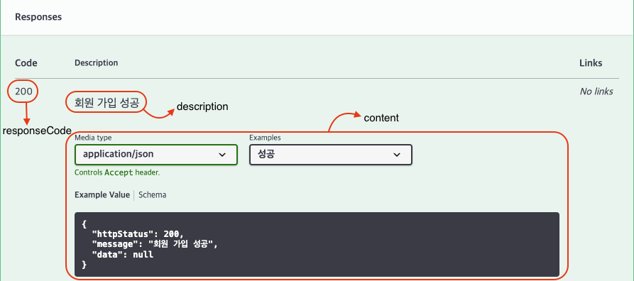
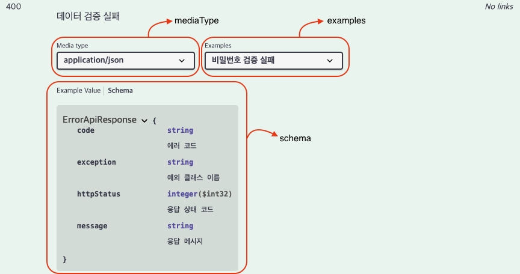
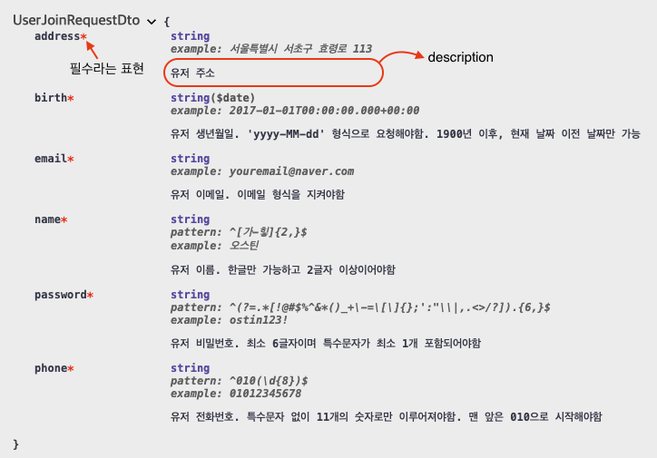

# Swagger 3.0.0을 이용한 API 명세 자동화

&nbsp;&nbsp; 최신 버전의 Swagger 라이브러리를 사용하기 위해 공부를 하였고, 책에 나와있는 2.9.2 버전과 다른 부분이 있어서 이를 공유하고자 이 글을 작성함

<br>

## 의존성 추가하기

&nbsp;&nbsp; `build.gradle` 파일에 다음과 같이 의존성을 추가한다.

```
implementation 'io.springfox:springfox-boot-starter:3.0.0'
```

<br>

## 설정 정보 추가하기

&nbsp;&nbsp; Swagger 라이브러리를 사용하기 위한 설정 정보를 추가해야한다.

> WebConfig.java

&nbsp;&nbsp; 이 설정 정보를 추가하지 않으면 다음 에러 메세지와 함께 `NullPointerException` 예외가 발생하고 애플리케이션이 실행되지 않는다. 정확히는 @EnableWebMvc 어노테이션이 필요함  
`Cannot invoke "org.springframework.web.servlet.mvc.condition.PatternsRequestCondition.getPatterns()" because "this.condition" is null`

```java
import org.springframework.context.annotation.Configuration;
import org.springframework.web.servlet.config.annotation.EnableWebMvc;

@EnableWebMvc
@Configuration
public class WebConfig {
}
```

<br>

> SwaggerConfig.java

&nbsp;&nbsp; 실제 Swagger 설정 정보가 포함되는 클래스. 기존의 `@EnableSwagger2` 대신에 `@EnableOpenApi` 어노테이션을 사용한다.

```java
import org.springframework.context.annotation.Bean;
import org.springframework.context.annotation.Configuration;
import springfox.documentation.builders.ApiInfoBuilder;
import springfox.documentation.builders.PathSelectors;
import springfox.documentation.builders.RequestHandlerSelectors;
import springfox.documentation.oas.annotations.EnableOpenApi;
import springfox.documentation.service.ApiInfo;
import springfox.documentation.spi.DocumentationType;
import springfox.documentation.spring.web.plugins.Docket;

@EnableOpenApi
@Configuration
public class SwaggerConfig {

    private static final String BASE_PACKAGE = "com.miracle.userservice.controller";
    private static final String PATTERN = "/v1/**";
    private static final String TITLE = "Miracle User Service API";
    private static final String DESCRIPTION = "유저와 연관된 요청들을 처리하는 API";
    private static final String VERSION = "1.0";

    @Bean
    public Docket docket() {
        return new Docket(DocumentationType.OAS_30)
                .apiInfo(apiInfo())
                .select()
                .apis(RequestHandlerSelectors.basePackage(BASE_PACKAGE))
                .paths(PathSelectors.ant(PATTERN))
                .build();
    }

    private ApiInfo apiInfo() {
        return new ApiInfoBuilder()
                .title(TITLE)
                .description(DESCRIPTION)
                .version(VERSION)
                .build();
    }
}
```

- DocumentationType : Swagger 3.0.0 버전을 사용하므로 `SWAGGER_2` 대신 `OAS_30`을 사용
- additionalModels() : Swagger가 해당 객체를 모델링 할 수 있도록 명시 (API 명세 화면 상단에 `Could not resolve reference: undefined undefined` 에러가 표시된다면 이 메서드에 해당 객체를 추가해주어야함)
- useDefaultResponseMessages() : API 문서에서 기본적인 Response Data를 표시할 지 설정. false로 설정하지 않으면 201, 400, 401 등 우리가 명시하지 않는 응답 코드가 자동으로 표시됨
- apis() : 문서화할 API 정보가 담긴 패키지를 명시. Swagger는 해당 패키지부터 스캔함
- paths() : 요청 경로를 명시. `PathSelectors.any()`를 넣어주면 모든 경로에 대해 문서화를 해준다. 혹은 `ant()` 메서드나 `regex()` 메서드로 경로를 표현할 수 있음
- apiInfo() : API 정보를 담는 메서드. API 문서의 최상단에 표시됨

  

<br>

## API 정보 표시하기

### @Operation

&nbsp;&nbsp; API의 정보를 표현하는 어노테이션. 메서드 레벨에서 사용함

- summary : 해당 API의 요약 설명
- description : 해당 API의 상세 설명
- responses : 여러 응답에 대한 정보. `@ApiResponse` 어노테이션이 사용됨. 여러 개인 경우 배열로 넣어줌


<br>

### @ApiResponse

&nbsp;&nbsp; API 응답 정보를 표현하는 어노테이션

- responseCode : 응답 상태 코드
- description : 해당 응답의 설명
- content : 해당 응답의 내용. `@Content` 어노테이션을 사용



<br>

### @Content

&nbsp;&nbsp; API 내용을 표현하는 어노테이션

- medieType : 미디어 타입
- examples : 예시 표현들. `@ExampleObject` 어노테이션을 사용. 여러 개인 경우 배열로 넣어줌
- schema : 스키마 표현. `@Schema` 어노테이션을 사용



<br>

### @ExampleObject

&nbsp;&nbsp; 해당 응답에 대한 여러 예시들을 표현하는 어노테이션

- name : 해당 예시의 이름
- value : 예시 값


<br>

### @Schema

&nbsp;&nbsp; 스키마 정보를 설정하는 어노테이션

- implementation : 스키마 정보로 해당 객체를 인용함
- description : 해당 스키마의 설명
- required : 필수 여부
- example : 예시



<br>

## 사용 예시

### API 정보

```java
@Operation(
        summary = "유저 회원 가입 요청 처리",
        description = "유저의 회원 가입 요청을 처리하는 API. 성공 시 DB에 유저의 정보가 저장됨",
        responses = {
                @ApiResponse(
                        responseCode = "200",
                        description = "회원 가입 성공",
                        content = @Content(
                                mediaType = "application/json",
                                examples = @ExampleObject(
                                        name = "성공",
                                        value = """
                                                {
                                                  "httpStatus": 200,
                                                  "message": "회원 가입 성공",
                                                  "data": null
                                                }
                                                """
                                ),
                                schema = @Schema(implementation = SuccessApiResponse.class)
                        )
                ),
                @ApiResponse(
                        responseCode = "400",
                        description = "데이터 검증 실패",
                        content = @Content(
                                mediaType = "application/json",
                                examples = {
                                        @ExampleObject(
                                                name = "이메일 검증 실패",
                                                value = """
                                                        {
                                                          "httpStatus": 400,
                                                          "message": "이메일 형식이 올바르지 않습니다.",
                                                          "code": "400_1",
                                                          "exception": "MethodArgumentNotValidException"
                                                        }
                                                        """
                                        ),
                                        @ExampleObject(
                                                name = "이름 검증 실패",
                                                value = """
                                                        {
                                                          "httpStatus": 400,
                                                          "message": "이름 형식이 올바르지 않습니다.",
                                                          "code": "400_2",
                                                          "exception": "MethodArgumentNotValidException"
                                                        }
                                                        """
                                        ),
                                        @ExampleObject(
                                                name = "비밀번호 검증 실패",
                                                value = """
                                                        {
                                                          "httpStatus": 400,
                                                          "message": "비밀번호 형식이 올바르지 않습니다.",
                                                          "code": "400_3",
                                                          "exception": "MethodArgumentNotValidException"
                                                        }
                                                        """
                                        ),
                                        @ExampleObject(
                                                name = "전화번호 검증 실패",
                                                value = """
                                                        {
                                                          "httpStatus": 400,
                                                          "message": "전화번호 형식이 올바르지 않습니다.",
                                                          "code": "400_4",
                                                          "exception": "MethodArgumentNotValidException"
                                                        }
                                                        """
                                        ),
                                        @ExampleObject(
                                                name = "생년월일 검증 실패",
                                                value = """
                                                        {
                                                          "httpStatus": 400,
                                                          "message": "생년월일 형식이 올바르지 않습니다.",
                                                          "code": "400_5",
                                                          "exception": "MethodArgumentNotValidException"
                                                        }
                                                        """
                                        ),
                                        @ExampleObject(
                                                name = "주소 검증 실패",
                                                value = """
                                                        {
                                                          "httpStatus": 400,
                                                          "message": "주소 형식이 올바르지 않습니다.",
                                                          "code": "400_6",
                                                          "exception": "MethodArgumentNotValidException"
                                                        }
                                                        """
                                        )
                                },
                                schema = @Schema(implementation = ErrorApiResponse.class)
                        )
                ),
                @ApiResponse(
                        responseCode = "401",
                        description = "비정상적인 요청",
                        content = @Content(
                                mediaType = "application/json",
                                examples = @ExampleObject(
                                        name = "토큰 검증 실패",
                                        value = """
                                                {
                                                  "httpStatus": 401,
                                                  "message": "올바르지 않은 요청입니다.",
                                                  "code": "401",
                                                  "exception": "InvalidRequestStateException"
                                                }
                                                """
                                ),
                                schema = @Schema(implementation = ErrorApiResponse.class)
                        )
                )
        }
)
```

### Schema 정보

```java
@Data
public class UserJoinRequestDto {

    @Schema(
            description = "유저 이메일. 이메일 형식을 지켜야함",
            required = true,
            example = "youremail@naver.com"
    )
    @Email(message = ValidationDefaultMsgUtil.EMAIL)
    @NotBlank(message = ValidationDefaultMsgUtil.EMAIL)
    private final String email;

    @Schema(
            description = "유저 이름. 한글만 가능하고 2글자 이상이어야함",
            required = true,
            example = "오스틴"
    )
    @Pattern(regexp = "^[가-힣]{2,}$", message = ValidationDefaultMsgUtil.NAME)
    @NotBlank(message = ValidationDefaultMsgUtil.NAME)
    private final String name;

    @Schema(
            description = "유저 비밀번호. 최소 6글자이며 특수문자가 최소 1개 포함되어야함",
            required = true,
            example = "ostin123!"
    )
    @Pattern(regexp = "^(?=.*[!@#$%^&*()_+\\-=\\[\\]{};':\"\\\\|,.<>/?]).{6,}$", message = ValidationDefaultMsgUtil.PASSWORD)
    @NotBlank(message = ValidationDefaultMsgUtil.PASSWORD)
    private final String password;

    @Schema(
            description = "유저 전화번호. 특수문자 없이 11개의 숫자로만 이루어져야함. 맨 앞은 010으로 시작해야함",
            required = true,
            example = "01012345678"
    )
    @Pattern(regexp = "^010(\\d{8})$", message = ValidationDefaultMsgUtil.PHONE)
    @NotBlank(message = ValidationDefaultMsgUtil.PHONE)
    private final String phone;

    @Schema(
            description = "유저 생년월일. 'yyyy-MM-dd' 형식으로 요청해야함. 1900년 이후, 현재 날짜 이전 날짜만 가능",
            required = true,
            example = "2017-01-01"
    )
    @Birth(message = ValidationDefaultMsgUtil.BIRTH)
    private final LocalDate birth;

    @Schema(
            description = "유저 주소",
            required = true,
            example = "서울특별시 서초구 효령로 113"
    )
    @NotBlank(message = ValidationDefaultMsgUtil.ADDRESS)
    private final String address;
}
```

<br>

## API 문서 공유 방법

1. 애플리케이션 실행
2. `{ip}:{post}/swagger-ui/index.html` 경로로 이동  
   `ex) localhost:8080/swagger-ui/index.html`
3. API 제목 아래에 있는 링크 클릭  
   `ex) http://localhost:8080/v3/api-docs`
4. json 데이터 복사
5. 복사한 데이터를 프로젝트 API 설명에 올리기! (`` 블록으로 감싸야함 반드시! 그래야 보는 사람이 에러가 나지 않음)

<br>

## API 문서 보는 방법

1. 프로젝트의 API 설명에 들어가서 원하는 API 클릭
2. json 데이터 복사
3. [Swagger Editor](https://editor-next.swagger.io/)로 이동
4. 복사한 json 데이터 붙여넣기 하면 끝