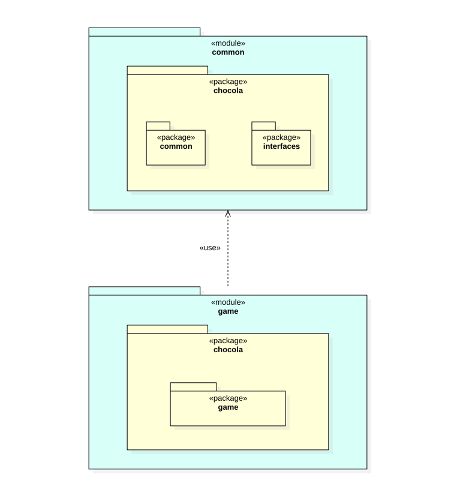

# game 모듈 설계

## game 모듈 목적

&nbsp;&nbsp; game 모듈은 game 프로젝트 모듈로서 최상위 모듈에 해당한다.
game 모듈은 common 모듈에서 제공하는 인터페이스를 통해 하위 게임 모듈들을 사용하며 게임을 찾고 시작하는 역할을 한다.

## 설계 상세

### 패키지 다이어그램



### Main 클래스

```java
package chocola.game;

import chocola.interfaces.Game;
import chocola.interfaces.GameManager;

import java.util.Optional;

public class Main {

    public static void main(String[] args) {
        String gameName = "omok";
        Optional<Game> gameOpt = GameManager.findGame(gameName);

        if (gameOpt.isEmpty()) throw new IllegalStateException();

        Game game = gameOpt.get();
        play(game);
    }

    private static void play(Game game) {
        game.start();
        game.end();
    }
}
```

&nbsp;&nbsp; `gameName` 값으로 게임 이름을 지정하면 해당 게임을 찾아 실행시킨다.

&nbsp;&nbsp; 하지만 위와 같은 방법으로 게임을 실행하게 되면, 게임을 바꿀 때마다 코드를 변경해야 하는 번거로움이 있을 것으로 예상됐다.
따라서, 게임 리스트를 나열한 후 원하는 항목을 선택하도록 변경하였다.

```java
package chocola.game;

import chocola.common.IOProcessor;
import chocola.interfaces.Game;
import chocola.interfaces.GameManager;

import java.util.List;

public class Main {

    public static void main(String[] args) {
        List<Game> gameList = GameManager.getList();
        StringBuilder gameListStringBuilder = new StringBuilder();
        for (int i = 0; i < gameList.size(); i++) {
            Game game = gameList.get(i);
            gameListStringBuilder
                    .append("%d: %s".formatted(i + 1, game.getName()))
                    .append(" | ");
        }

        int lastIdx = gameListStringBuilder.lastIndexOf(" | ");
        IOProcessor.println(gameListStringBuilder.substring(0, lastIdx));

        int number = readGameNumber(gameList.size());
        Game game = gameList.get(number);
        play(game);
    }

    private static int readGameNumber(int max) {
        IOProcessor.println("게임을 선택하세요.");
        String input = IOProcessor.readLine();

        while (!isInt(input) || !isValidRange(input, max)) {
            IOProcessor.println("목록 내 숫자를 입력해 주세요.");
            input = IOProcessor.readLine();
        }

        return Integer.parseInt(input) - 1;
    }

    private static boolean isInt(String input) {
        try {
            Integer.parseInt(input);
            return true;
        } catch (NumberFormatException e) {
            return false;
        }
    }

    private static boolean isValidRange(String input, int max) {
        int i = Integer.parseInt(input);
        return i >= 1 && i <= max;
    }

    private static void play(Game game) {
        game.start();
        game.end();
    }
}
```

___
[<== prev](/game-02)