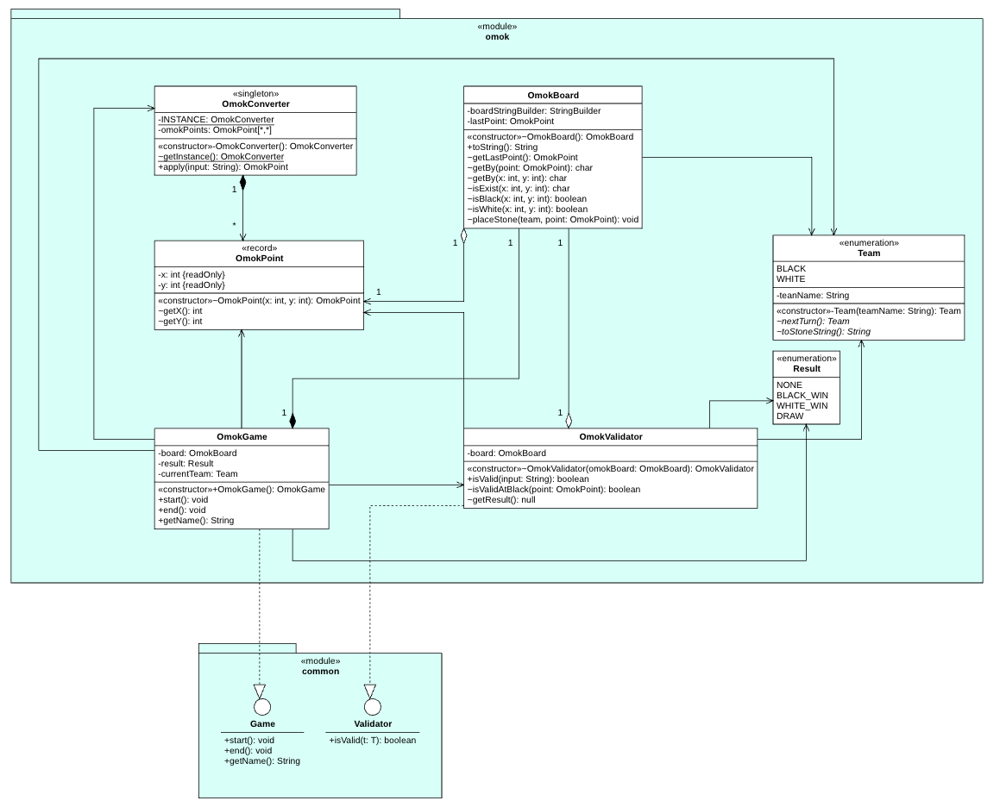

# omok 모듈 설계

## omok 모듈 목적

&nbsp;&nbsp; omok 모듈은 실제 오목 게임을 구현하는 역할을 한다.
오목 요구사항을 작성하고, 해당 요구사항에 맞춰 구현하였다.

## 요구사항

&nbsp;&nbsp; 요구사항은 omok 모듈의 [README 파일](https://github.com/chocolaggibbiddori/game/blob/main/omok/README.md)을 참고 하시길 바랍니다.

## 설계 상세

### 클래스 다이어그램



### OmokGame 클래스

#### 코드

```java
package chocola.omok;

import chocola.common.InvalidInputException;
import chocola.interfaces.Game;

import static chocola.common.IOProcessor.*;

public class OmokGame implements Game {

    private final OmokBoard board;
    private Result result;
    private Team currentTeam = Team.BLACK;

    public OmokGame() {
        board = new OmokBoard();
        result = Result.NONE;
    }

    @Override
    public void start() {
        printStartMessage();
        println(board.toString());
        play();
    }

    private void play() {
        while (result == Result.NONE)
            turn();
    }

    private void turn() {
        print("%s돌을 놓아주세요: ".formatted(currentTeam.teamName));

        OmokConverter converter = OmokConverter.getInstance();
        OmokValidator validator = new OmokValidator(board);

        try {
            OmokPoint point = readLine(validator, converter);
            if (currentTeam == Team.BLACK && !validator.isValidAtBlack(point)) {
                throw new InvalidInputException();
            }

            board.placeStone(currentTeam, point);
            println(board.toString());
            currentTeam = currentTeam.nextTurn();
            result = validator.getResult();
        } catch (InvalidInputException e) {
            println("해당 좌표에는 놓을 수 없습니다.");
        }
    }

    @Override
    public void end() {
        switch (result) {
            case BLACK_WIN -> {
                println("흑 승리!!!");
                printEndMessage();
            }
            case WHITE_WIN -> {
                println("백 승리!!!");
                printEndMessage();
            }
            case DRAW -> printDrawMessage();
            default -> throw new IllegalStateException("Unexpected value: " + result);
        }
    }

    @Override
    public String getName() {
        return "omok";
    }
}
```

#### 특징

1. `OmokGame` 클래스는 오목 게임에 대한 전반적인 컨트롤 타워다. 즉, 오목 게임 한 판 한 판이 `OmokGame` 객체에 해당한다.
각 게임은 보드판을 하나씩 가지고 있고, 게임의 결과, 현재 차례가 누구인지를 관장할 필요가 있기에 `OmokBoard`, `Result`, `Team` 객체를 필드로 가지고 있다.

2. `OmokGame` 클래스는 게임 프로젝트의 하위 구현 모듈이므로 `Game` 인터페이스를 구현한다.
`start()` 메서드에서 게임 시작 전처리를 한 후에 게임을 시작하고, `end()` 메서드에서 게임이 끝난 후처리를 한다.

3. 게임은 간단하게 두 팀이 번갈아 가며 진행하게 되는데, `turn()` 메서드의 구현이 중요해지게 된다.
사용자의 입력을 받아 검증한 후 돌을 놓고 다음 턴으로 넘기면 되는데, 검증은 `validator` 객체가 담당한다.

### OmokBoard 클래스

#### 코드

```java
package chocola.omok;

class OmokBoard {

    private static final int LINE_NUMBER = 16;
    private static final String INIT_BOARD_STRING = """
                                                    000000000000000
                                                    000000000000000
                                                    000000000000000
                                                    000000000000000
                                                    000000000000000
                                                    000000000000000
                                                    000000000000000
                                                    000000000000000
                                                    000000000000000
                                                    000000000000000
                                                    000000000000000
                                                    000000000000000
                                                    000000000000000
                                                    000000000000000
                                                    000000000000000
                                                    """;

    private final StringBuilder boardStringBuilder;
    private OmokPoint lastPoint;

    OmokBoard() {
        boardStringBuilder = new StringBuilder(INIT_BOARD_STRING);
    }

    @Override
    public String toString() {
        return boardStringBuilder.toString();
    }

    OmokPoint getLastPoint() {
        return lastPoint;
    }

    char getBy(OmokPoint point) {
        int x = point.x();
        int y = point.y();
        return getBy(x, y);
    }

    char getBy(int x, int y) {
        int idx = getIdx(x, y);
        return boardStringBuilder.charAt(idx);
    }

    boolean isExist(int x, int y) {
        return isBlack(x, y) || isWhite(x, y);
    }

    boolean isBlack(int x, int y) {
        return checkValue(x, y, '1');
    }

    boolean isWhite(int x, int y) {
        return checkValue(x, y, '2');
    }

    private boolean checkValue(int x, int y, char value) {
        return getBy(x, y) == value;
    }

    void placeStone(Team team, OmokPoint point) {
        int x = point.x();
        int y = point.y();
        int idx = getIdx(x, y);
        boardStringBuilder.replace(idx, idx + 1, team.toStoneString());
        lastPoint = point;
    }

    private int getIdx(int x, int y) {
        return --x * LINE_NUMBER + --y;
    }
}
```

#### 특징

1. `OmokBoard` 객체는 오목 모듈 내에서만 사용되는 객체이므로 default 접근 제어자로 지정했다.
2. `OmokBoard` 객체는 오목 보드에 대한 전반적인 책임을 가진다. 즉, 보드의 정보를 알려주고 관리한다.
3. 보드를 출력하기 위한 방법이 2가지 정도 있었다.
첫 번째는 `Stone[][]` 필드를 두어서 배열로 보드를 구현하는 것.
두 번째는 문자열로 구현하는 것.
배열로 구현하는 방식은 보드를 문자열로 출력할 때마다 배열을 처음부터 돌면서 문자열로 변환해야 하므로 비용이 많이 발생한다고 판단했다.
때문에 현재 보드를 문자열로 계속 저장해놓고 필요할 때마다 그대로 출력하면 되는 문자열 구현 방식을 택했다.
4. 오목 승리 조건 등을 판단할 때, 마지막에 놓여진 돌의 위치를 알고 있으면 용이하게 판단할 수 있으므로 `lastPoint` 필드를 두었다.

### OmokValidator 클래스

#### 코드

```java
package chocola.omok;

import chocola.interfaces.Validator;

class OmokValidator implements Validator<String> {

    private final OmokBoard board;

    OmokValidator(OmokBoard omokBoard) {
        board = omokBoard;
    }

    @Override
    public boolean isValid(String input) {
        String[] split = input.split(",");
        if (split.length != 2) return false;

        String s1 = split[0].trim();
        String s2 = split[1].trim();

        try {
            int x = Integer.parseInt(s1);
            int y = Integer.parseInt(s2);

            return isValid(x, y);
        } catch (NumberFormatException e) {
            return false;
        }
    }

    private boolean isValid(int x, int y) {
        return isValidRange(x, y) && !board.isExist(x, y);
    }

    private boolean isValidRange(int x, int y) {
        return isValidRange(x) && isValidRange(y);
    }

    private boolean isValidRange(int n) {
        return n >= 1 && n <= 15;
    }

    boolean isValidAtBlack(OmokPoint point) {
        int _33LineNum = 0;

        Direction[] directions = Direction.values();
        for (Direction direction : directions) {
            String line1 = getStraightLine(point, 4, 1, direction);
            String line2 = getStraightLine(point, 3, 2, direction);

            if (is33Line(line1) || is33Line(line2)) ++_33LineNum;
            if (_33LineNum == 2) return false;
        }

        return true;
    }

    private boolean is33Line(String line) {
        String[] forbiddenLines = {"001100", "010100", "011000", "001010", "010010"};

        for (String forbiddenLine : forbiddenLines)
            if (forbiddenLine.equals(line)) return true;

        return false;
    }

    Result getResult() {
        if (isDraw()) return Result.DRAW;

        OmokPoint lastPoint = board.getLastPoint();
        Direction[] directions = Direction.getHalfRound();
        int max = 4;

        for (Direction direction : directions) {
            String line = getStraightLine(lastPoint, max, direction);

            if (isWinner(line, Team.BLACK)) return Result.BLACK_WIN;
            else if (isWinner(line, Team.WHITE)) return Result.WHITE_WIN;
        }

        return Result.NONE;
    }

    private boolean isWinner(String line, Team team) {
        String winCond = team.toStoneString().repeat(5);
        int idx = line.indexOf(winCond);
        int lastIdx = line.lastIndexOf(winCond);

        return idx != -1 && idx == lastIdx;
    }

    private boolean isDraw() {
        for (char c : board.toString().toCharArray())
            if (c == '0') return false;

        return true;
    }

    private String getStraightLine(OmokPoint point, int max, Direction direction) {
        return getStraightLine(point, max, max, direction);
    }

    private String getStraightLine(OmokPoint point, int directionMax, int oppositeDirectionMax, Direction direction) {
        Direction oppositeDirection = direction.getOppositeDirection();

        String directionLine = getHalfStraightLine(point, directionMax, direction);
        String oppositeDirectionLine = getHalfStraightLine(point, oppositeDirectionMax, oppositeDirection);
        char currentStone = board.getBy(point);

        return requireReverse(direction) ?
                directionLine + currentStone + oppositeDirectionLine :
                oppositeDirectionLine + currentStone + directionLine;
    }

    private String getHalfStraightLine(OmokPoint point, int max, Direction direction) {
        StringBuilder sb = new StringBuilder(max);
        int x = point.x();
        int y = point.y();

        for (int i = x + direction.xDirection, j = y + direction.yDirection, cnt = 0;
             cnt < max && isValidRange(i, j);
             i += direction.xDirection, j += direction.yDirection, ++cnt) {
            sb.append(board.getBy(i, j));
        }

        return requireReverse(direction) ? sb.reverse().toString() : sb.toString();
    }

    private boolean requireReverse(Direction direction) {
        return switch (direction) {
            case UP, UP_RIGHT, RIGHT, DOWN_RIGHT -> false;
            case DOWN, DOWN_LEFT, LEFT, UP_LEFT -> true;
        };
    }

    private enum Direction {

        UP(-1, 0) {
            @Override
            Direction getOppositeDirection() {
                return DOWN;
            }
        },
        UP_RIGHT(-1, 1) {
            @Override
            Direction getOppositeDirection() {
                return DOWN_LEFT;
            }
        },
        RIGHT(0, 1) {
            @Override
            Direction getOppositeDirection() {
                return LEFT;
            }
        },
        DOWN_RIGHT(1, 1) {
            @Override
            Direction getOppositeDirection() {
                return UP_LEFT;
            }
        },
        DOWN(1, 0) {
            @Override
            Direction getOppositeDirection() {
                return UP;
            }
        },
        DOWN_LEFT(1, -1) {
            @Override
            Direction getOppositeDirection() {
                return UP_RIGHT;
            }
        },
        LEFT(0, -1) {
            @Override
            Direction getOppositeDirection() {
                return RIGHT;
            }
        },
        UP_LEFT(-1, -1) {
            @Override
            Direction getOppositeDirection() {
                return DOWN_RIGHT;
            }
        };

        final int xDirection;
        final int yDirection;

        Direction(int xDirection, int yDirection) {
            this.xDirection = xDirection;
            this.yDirection = yDirection;
        }

        static Direction[] getHalfRound() {
            return new Direction[]{UP, UP_RIGHT, RIGHT, DOWN_RIGHT};
        }

        abstract Direction getOppositeDirection();
    }
}
```

#### 특징

1. `OmokValidator` 객체는 오목 모듈 내에서만 사용되는 객체이므로 default 접근 제어자로 지정했다.
2. `OmokValidator` 객체는 오목 게임의 규칙에 대한 전반적인 책임을 진다.
3. 사용자의 입력이 유효한지 판단할 때에도 `OmokValidator` 객체에서 담당하므로 `Validator` 인터페이스를 구현한다.
4. 검증을 하기 위해서는 특정 게임 보드가 필요하므로 `OmokBoard` 객체를 필드로 두었다.
5. 검증의 용이함을 위해 내부에 열거형 타입의 `Direction` 클래스를 두었다.

### OmokConverter 클래스

#### 코드

```java
package chocola.omok;

import java.util.function.Function;

class OmokConverter implements Function<String, OmokPoint> {

    private static final OmokConverter INSTANCE = new OmokConverter();
    private final OmokPoint[][] omokPoints;

    private OmokConverter() {
        omokPoints = new OmokPoint[16][16];
        for (int i = 1; i < omokPoints.length; i++)
            for (int j = 1; j < omokPoints[i].length; j++)
                omokPoints[i][j] = new OmokPoint(i, j);
    }

    static OmokConverter getInstance() {
        return INSTANCE;
    }

    @Override
    public OmokPoint apply(String input) {
        String[] split = input.split(",");
        String s1 = split[0].trim();
        String s2 = split[1].trim();
        int x = Integer.parseInt(s1);
        int y = Integer.parseInt(s2);
        return omokPoints[x][y];
    }
}
```

#### 특징

1. `OmokConverter` 객체는 오목 모듈 내에서만 사용되는 객체이므로 default 접근 제어자로 지정했다.
2. `OmokConverter` 객체는 사용자의 입력을 오목 게임에서 사용할 `OmokPoint` 객체로 변환하는 책임을 진다.
3. `OmokConverter` 객체는 모든 객체가 항상 같은 역할을 수행할 것이므로 싱글톤 패턴을 적용했다.
4. 사용자의 입력을 `OmokPoint` 객체로 변환할 때, `new` 연산자를 이용해 객체를 생성하게 되면 `OmokPoint` 객체가 아주 많아질 것으로 예상된다.
그래서 새로 객체를 생성하는 대신 `omokPoints` 필드에서 모든 `OmokPoint` 객체들을 미리 저장하고 꺼내오는 방식으로 구현했다.
`OmokPoint` 객체는 불변 객체이기 때문에 해당 방식에 문제가 없다고 판단했다.

### OmokPoint 클래스

#### 코드

```java
package chocola.omok;

record OmokPoint(int x, int y) {
}
```

#### 특징

1. `OmokPoint` 객체는 오목 모듈 내에서만 사용되는 객체이므로 default 접근 제어자로 지정했다.
2. `OmokPoint` 객체는 단순히 오목 좌표를 나타내는 객체로서 그 값이 변경 되어서도 안 되므로 `record` 타입으로 설계했다.

### Team 클래스

#### 코드

```java
package chocola.omok;

enum Team {

    BLACK("흑") {
        @Override
        Team nextTurn() {
            return Team.WHITE;
        }

        @Override
        public String toStoneString() {
            return "1";
        }
    },

    WHITE("백") {
        @Override
        Team nextTurn() {
            return Team.BLACK;
        }

        @Override
        public String toStoneString() {
            return "2";
        }
    };

    final String teamName;

    Team(String teamName) {
        this.teamName = teamName;
    }

    abstract Team nextTurn();

    abstract String toStoneString();
}
```

### Result 클래스

#### 코드

```java
package chocola.omok;

enum Result {

    NONE,
    BLACK_WIN,
    WHITE_WIN,
    DRAW
}
```

## 회고

### 고민

&nbsp;&nbsp; 글을 작성하면서 코드들을 다시 보니 고민이 하나 생겼다.
`OmokGame` 클래스의 `turn()` 메서드에서 최초 코드를 구현할 때는 `converter`, `validator` 객체는 다른 메서드에서는 사용하지 않으니 해당 메서드 내에서 생성하도록 구현했다.
`converter` 객체는 싱글톤이니 상관없으나 `validator` 객체는 `turn()` 메서드가 실행될 때마다 새로 생성되니 이 점에서 낭비가 아닌가? 하는 생각이 들었다.

&nbsp;&nbsp; 가장 쉬운 해결 방법은 `validator` 객체를 `OmokGame` 클래스의 필드로 두는 것이다.
그러면서 `OmokValidator` 클래스를 봤더니, 이 객체는 `OmokBoard` 객체를 변경할 수 있는 또 다른 문제가 있었다!
`OmokValidator` 객체는 단순히 검증만을 수행해야 하므로 `OmokBoard` 객체를 변경해서는 안 된다.
물론 내가 그런 메서드를 사용하지 않으면 되지만 행여나 실수할 여지가 있으므로 제한할 필요가 있다고 생각했다.

&nbsp;&nbsp; `OmokValidator` 내에서 `OmokBoard` 객체를 방어적 복사해서 사용하는 방법이 있지만,
그러면 `OmokGame` 객체가 `OmokValidator` 객체를 필드로 가지고 있는 것이 의미가 없어진다.
또한 방어적 복사를 하도록 구현하면, `OmokValidator` 클래스도 싱글톤 패턴을 적용하거나 유틸리티 클래스로 만들고 모든 메서드의 매개변수로 `OmokBoard` 객체를 받아야 한다.

&nbsp;&nbsp; 결론적으로, `OmokValidator` 객체를 `OmokGame` 객체의 필드로 두는 것이 낫겠다고 판단했다.
`turn()` 메서드가 실행될 때마다 객체를 생성하는 것은 불필요하며 `OmokValidator` 클래스에서 생성자로 `OmokBoard` 객체를 받는 것이 무색해진다.
따라서, 처음부터 `OmokGame`, `OmokBoard`, `OmokValidator` 세 객체는 함께 가되, `OmokValidator` 객체 내에서 `OmokBoard` 객체를 변경하지 않도록 하기로 했다.
왜냐하면 어차피 나 혼자 개발하는거니까 실수할 여지는 없다고 생각했기 때문이다.
다음에는 체스 게임을 구현해볼 생각인데 그 때는 검증기를 게임 객체 내에 필드로 두고 설계 해야겠다.

### 어려웠던 점

&nbsp;&nbsp; 흑돌의 규칙에서 33은 둘 수 없다는 규칙이 있는데 이게 꽤나 어려웠다.
33이라는 것을 어떻게 판단할 것인가에 대해서인데, 여기저기 찾아보니 33 규칙은 꽤나 복잡한 룰이였다.

&nbsp;&nbsp; 끈임없이 고민해 보았지만 마땅한 해결법을 찾지 못해 일단 적어내기 시작했다.
33이 나오는 모든 경우를 종이에 다 적고 패턴을 찾기 시작했다.
다행이도 경우의 수 들이 일반적인 패턴을 보였고, 나는 그것을 찾아내서 프로그램에 적용했다.
`OmokValidator` 클래스의 `is33Line(String)` 메서드에 있는 `forbiddenLines` 변수가 바로 간추려낸 패전이다.

### 아쉬웠던 점

&nbsp;&nbsp; 클래스 다이어그램에 관심을 가지게 된 것이 오목을 모두 구현하고 난 후였다.
그래서 이번에는 다이어그램 그리는 연습도 할 겸 내가 구현했던 것을 다이어그램으로 그려보았지만
다음에 체스를 만들 때에는 다이어그램을 먼저 구현한 후에 그것에 맞춰 체스 게임을 구현해보려고 한다.

___
[<== prev](/game-03)